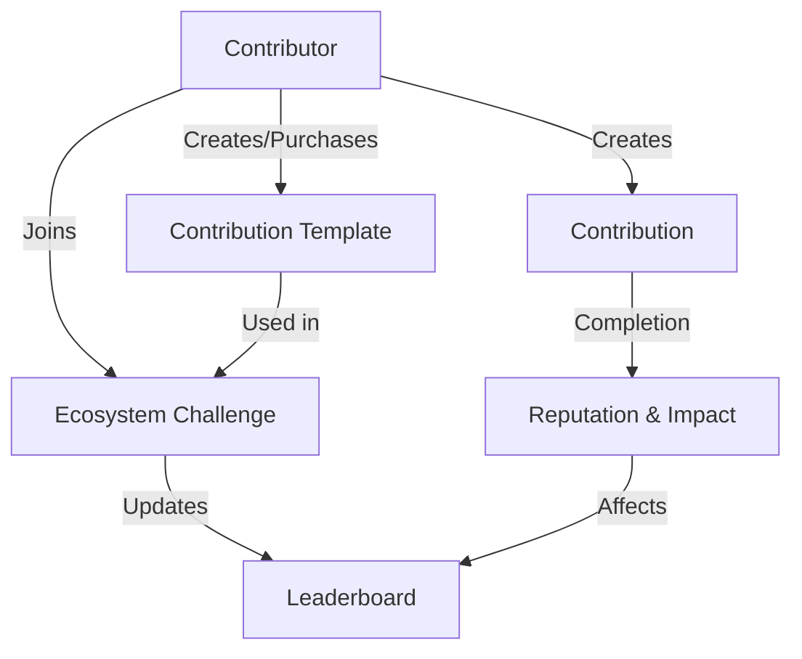

# Parse Optimism: Contribution Tracking Protocol

A decentralized system for tracking, rewarding, and incentivizing meaningful contributions to the Optimism ecosystem.

## Overview

Parse Optimism is a blockchain-powered contribution tracking platform that creates transparent, verifiable metrics for participation in decentralized protocol development. Users can create, track, and earn rewards for various types of contributions across development, governance, community, and research domains.

### Key Features

- Track contributions across multiple categories (Development, Governance, Community, Research)
- Earn reputation points for impactful protocol participation
- Create and share contribution templates
- Participate in ecosystem-wide contribution challenges
- Verifiable contribution tracking on the blockchain
- Dynamic difficulty and reward scoring
- Competitive leaderboards to encourage engagement

## Architecture

The system is built on a single smart contract that manages contribution tracking and incentivization through interconnected data structures and functions.



### Core Components

1. **Contributions**: Protocol participation tracking with customizable parameters
2. **User Profiles**: Track reputation, impact, and overall ecosystem involvement
3. **Contribution Templates**: Shareable protocol participation blueprints
4. **Ecosystem Challenges**: Collective initiatives to drive protocol development
5. **Leaderboards**: Track participant impact and contributions

## Contract Documentation

### Contribution Management

#### Creating Contributions

```clarity
(create-contribution 
  name: string-ascii
  description: string-utf8
  category: uint
  difficulty: uint
  impact-score: uint
  template-id: optional uint) -> (response uint uint)
```

Creates a new contribution with specified parameters. Returns the new contribution ID.

#### Completing Contributions

```clarity
(complete-contribution contribution-id: uint) -> (response bool uint)
```

Logs completion of a contribution and updates reputation, impact scores, and challenge leaderboards.

### Ecosystem Features

#### Creating Templates

```clarity
(create-contribution-template
  name: string-ascii
  description: string-utf8
  category: uint
  difficulty: uint
  recommended-impact: uint
  for-sale: bool
  price: uint) -> (response uint uint)
```

Creates a shareable contribution template that can be shared or sold.

#### Ecosystem Challenges

```clarity
(create-ecosystem-challenge
  name: string-ascii
  description: string-utf8
  contribution-template-id: uint
  start-date: uint
  end-date: uint) -> (response uint uint)
```

Creates an ecosystem challenge based on a contribution template.

## Getting Started

### Prerequisites

- Clarinet
- Stacks Wallet
- Basic understanding of Clarity

### Installation

1. Clone the repository
2. Install dependencies with Clarinet
3. Deploy contract to local Clarinet chain or testnet

### Basic Usage

1. Create a contribution:
```clarity
(contract-call? .optimism-tracker create-contribution "Protocol Improvement" "Propose gas optimization" u1 u2 u50 none)
```

2. Complete a contribution:
```clarity
(contract-call? .optimism-tracker complete-contribution u1)
```

3. Join an ecosystem challenge:
```clarity
(contract-call? .optimism-tracker join-challenge u1)
```

## Function Reference

### Read-Only Functions

- `get-user-contributions`: Returns list of user's contributions
- `get-contribution`: Returns contribution details
- `get-user-profile`: Returns user profile information
- `get-contribution-impact-info`: Returns impact information for a contribution
- `get-challenge-leaderboard`: Returns challenge leaderboard data

### Public Functions

- `create-contribution`: Create new contribution
- `complete-contribution`: Log contribution completion
- `create-contribution-template`: Create shareable template
- `join-challenge`: Join ecosystem challenge
- `purchase-template`: Purchase contribution template
- `toggle-contribution-active`: Toggle contribution active status

## Development

### Testing

Run tests using Clarinet:
```bash
clarinet test
```

### Local Development

1. Start local Clarinet console:
```bash
clarinet console
```

2. Deploy contract:
```bash
(contract-call? .optimism-tracker ...)
```

## Security Considerations

### Limitations

- Contribution verification relies on community validation
- Ecosystem challenges have participant limits
- Template purchases require sufficient reputation

### Best Practices

- Always verify transaction success
- Monitor impact score calculations
- Consider gas costs when interacting with multiple functions
- Verify contribution ownership before modifications
- Keep private keys secure when interacting with mainnet